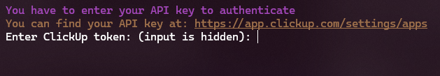
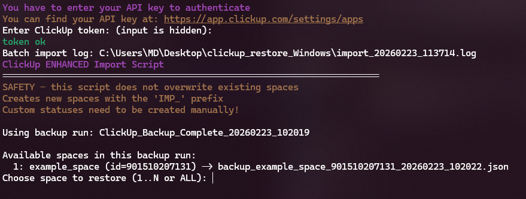
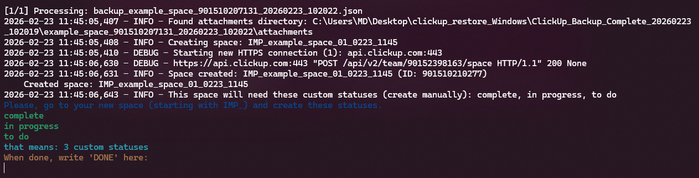
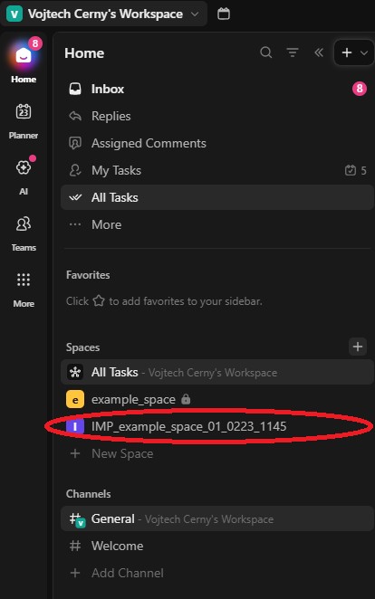
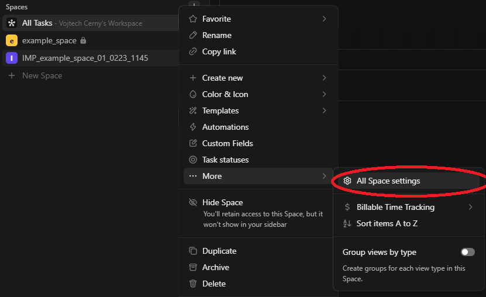
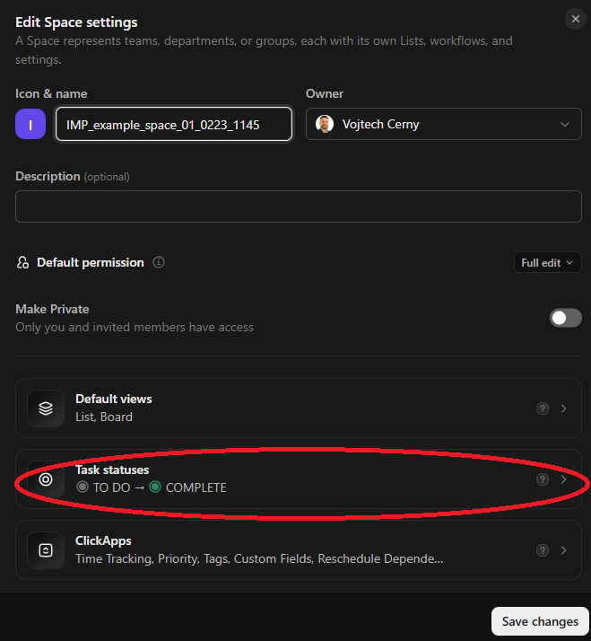
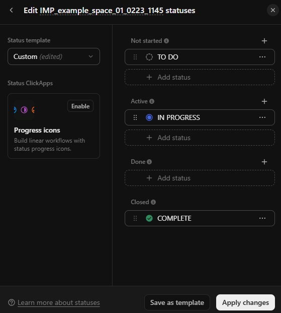
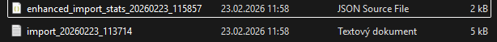

# ClickUp restore script
- supports restoring the entire backup (the `all` option) or restoring only a single space
- prepared executables for Windows and macOS (x86_64 and arm64) - Intel/Apple Silicon

## TLDR features
* creates a new space (or new spaces) in the workspace of the user performing the restore
* the user's `team_id` (based on the API key) and the `team_id` in the backup file must match
* does not modify or affect existing data in any way

## Usage
- to use the script, it must be placed in the same folder as the backup folder (`ClickUp_Backup_Complete_...`)

### Executables
- The executables are created via Github actions

### API key
- after launch, the user is prompted to enter their API key; it must correspond to the uploaded backup
- the API key is available at: https://app.clickup.com/9015257072/settings/apps

- the key can be entered either manually or via CTRL + C / CTRL + V

### Selecting the space to restore
- if the key is entered successfully, the user is presented with a selection of spaces from the backup file that can be restored:

- the supported options are `ALL` or a single space

### Creating statuses
- after selecting the space to restore, new (initially empty) spaces are created in the ClickUp UI
- at this point, the script is paused and the user is asked to create statuses in the ClickUp UI
    - the required statuses and their number are listed by the program

- if the required statuses are created by the user at this stage, all tasks will be assigned to the corresponding statuses correctly
- if they are not created and the user skips this step, all tasks will be set either to `TO-DO` or `COMPLETE` (the default ClickUp statuses in a new space), and they will need to be adjusted manually later

### Progress and closing
- once the restore is finished, the application closes automatically and creates two log files containing all necessary information about the import process after the upload is complete

# Warning
- restoring large spaces, takes quite a long time due to ClickUp API endpoint rate limiting
- all tasks are assigned to users, and all users will receive notifications about it
- the backup contains all data, including hidden parts.