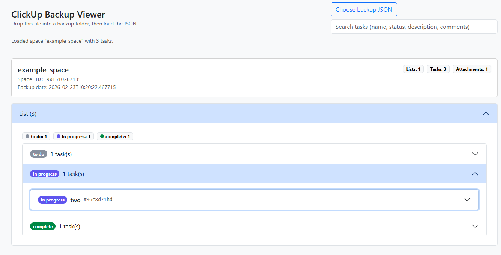
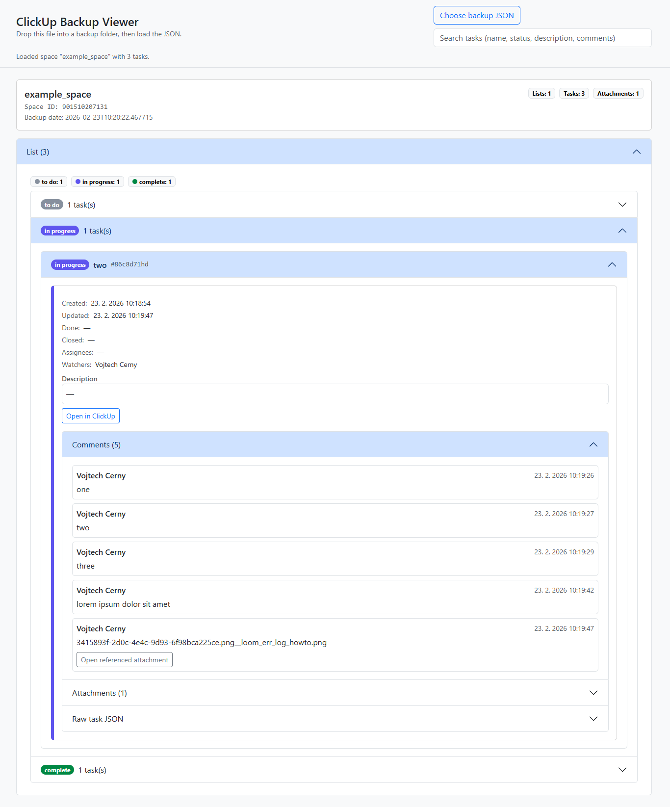

# ClickUp backup viewer
* This html viewer enables the user to see the contents of a backup of ClickUp spaces in case the service is completely not-available. 
* As this is meant as last-resort option, some corners have been cut in possible user experience as this tool should ideally never be used.

## Usage
* The file viewer.html has to be copied into a folder which contains the backup json file of a specific ClickUp space and the attachments.
* Then you simply open up the viewer.html in your browser of choice, set the source file to the json backup file in your folder and you're done.
    * Under these circumstances the viewer will show all contents of the backup including the attachments (images etc.).

## CAVE
* If you were to load a backup json file that has a different relative path then the current location of viewer.html, the json contents will be read correctly, but it will not be possible to view the attachments directly as their path will be different and therefore unreachable.

